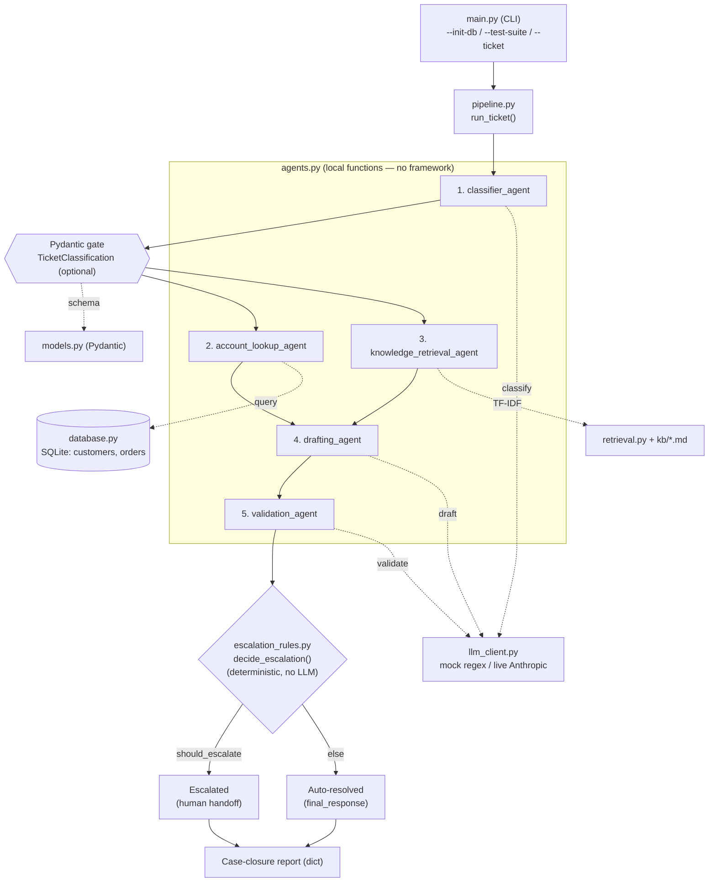

Here's the layout grouped by layer:

**1. Data & schemas**
- [models.py](models.py) — Pydantic schemas (TicketClassification, CaseReport)
- [database.py](database.py) — mock SQLite DB: customers, orders, seed data

**2. Knowledge / retrieval**
- [retrieval.py](retrieval.py) — TF-IDF retriever over `kb/`
- [kb/](kb/) — 5 policy markdown docs

**3. LLM & rules**
- [llm_client.py](llm_client.py) — mock + live LLM wrappers (classify/draft/validate)
- [escalation_rules.py](escalation_rules.py) — deterministic escalation gates (no LLM)

**4. Agents & orchestration**
- [agents.py](agents.py) — one function per agent
- [pipeline.py](pipeline.py) — wires agents into the full ticket flow

**5. Entry & tests**
- [main.py](main.py) — CLI entry point
- [test_tickets.py](test_tickets.py) — the 8 design-doc scenarios

Flow: entry → agents/pipeline → (LLM + rules + retrieval) → data.

## Architecture diagram



## Pipeline agents

`pipeline.py:run_ticket` wires the agents in this order. Every agent is a plain
function in the local `agents` module — there is **no third-party agent
framework** (CrewAI/AutoGen).

| # | Agent function | Source module | Notes |
|---|----------------|---------------|-------|
| 1 | `classifier_agent` | `agents` (local) | issue type, urgency, sentiment, confidence |
| 2 | `account_lookup_agent` | `agents` (local) | customer + orders from SQLite |
| 3 | `knowledge_retrieval_agent` | `agents` (local) | TF-IDF over `kb/*.md` |
| 4 | `drafting_agent` | `agents` (local) | drafts the response |
| 5 | `validation_agent` | `agents` (local) | accuracy / policy / tone checks |
| 6 | `get_relevant_order_amount` | `agents` (local) | helper, not a full agent |

Non-`agents` pieces in the flow:
- **Escalation decision** — `escalation_rules.decide_escalation` (local,
  deterministic, no LLM). Hard-category rules run before the confidence gate
  (`CONFIDENCE_THRESHOLD = 0.75`).
- **Schema-validation gate** — `TicketClassification` from the local `models`
  module (Pydantic). Pydantic is the only external package touched in the
  pipeline, and it's **optional** — `pipeline.py` guards the import with
  `try/except`.
- `case_closure_agent` in the agent trace is just a label, not a function; the
  report dict is built inline.

## Run modes

- `mock` (default) — keyword/regex heuristics stand in for the LLM. Offline,
  zero cost, deterministic.
- `live` — set `SUPPORTPILOT_MODE=live` and `ANTHROPIC_API_KEY`. Real Anthropic
  calls (`claude-sonnet-5` by default; override with `SUPPORTPILOT_MODEL`).

## Common commands

```bash
python main.py --init-db                              # seed the mock SQLite DB (once)
python main.py --test-suite                           # run the 8 design-doc scenarios
python main.py --ticket "..." --customer CUST001 [--json]
```
